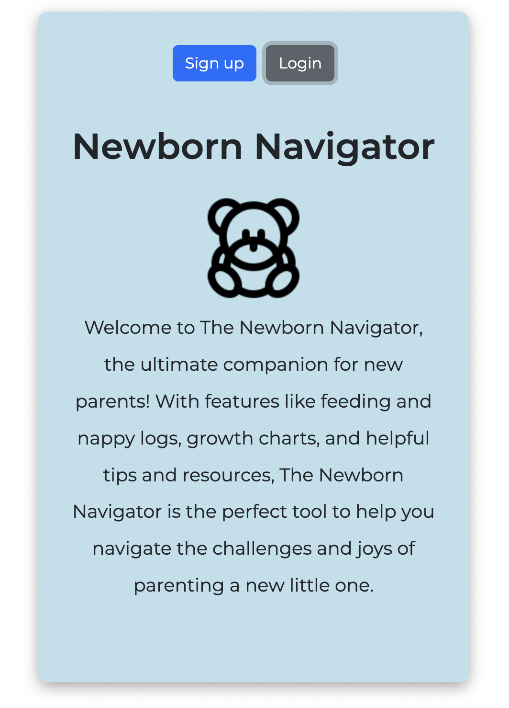
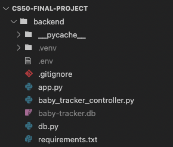
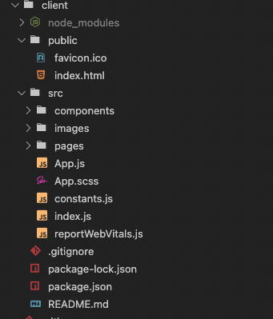
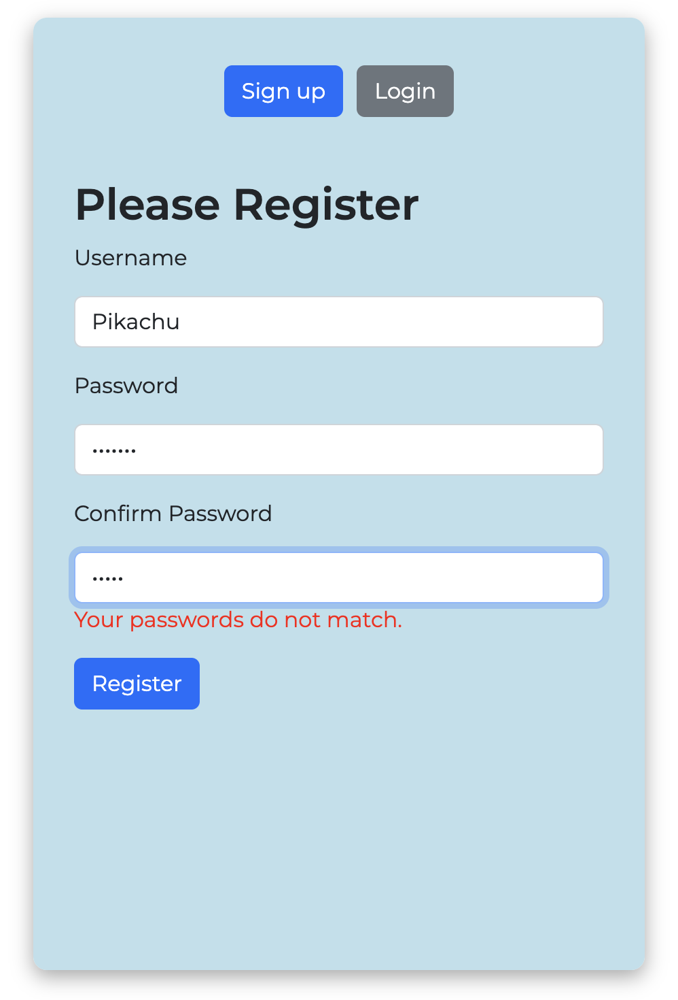

  
# The Newborn Navigator App

For my [final project](https://github.com/asianvader/cs50-final-project) for the CS50 course, I decided to develop a baby tracking app: the Newborn Navigator. I wanted to continue building features after I finished the course.

New parents can register and login to easily track their baby's feedings, nappy changes, and sleep patterns.

## Technology stack

[Flask](https://flask.palletsprojects.com/en/2.2.x/)

[React.js](https://reactjs.org/)

[React-Bootstrap](https://react-bootstrap.github.io/)

I created a REST API using Python and the Flask framework on the backend. I used the SQLite database to manage my data. For the frontend I used the React.js library. To style I used Bootstrap and React-Bootstrap CSS framework.

  

## Description

When registering and logging in, there is data validation to ensure that the data is the right format and is correct. The Newborn Navigator allows users to log feeds, sleeps/naps and nappy changes. There's also an activity history page where a user can view a summary of their baby's activities by using a select form to filter by category.

  

## Backend

  

I used SQLite 3 as my database and had one main database `baby-tracker.db` with three tables:

  

1.  `users`: Three columns with the ID as the primary key, username and password (which has been hashed).

2.  `baby_info`: The user ID, baby's name and date of birth.

3.  `activity`: Stored the user ID, baby's name, activity type, date and time, and a description.

  

In various pages I execute various GET requests and join the tables using the unique ID to search the database.

  

In my flask app I added a `.env` file to store secret keys.

  

**Authentication**

In addition to password hashing, I have added JSON Web Tokens (JWT) to authenticate users. Once a user has logged in, there must a token present in the HTTP header to do a POST or GET request. The JWT is created once a user logs in and is returned in the response body of the POST request. On the frontend I pass the token down the various pages/components through props.

  

## Frontend

  

I decided to use React.js on the Frontend as it is one of the most popular libraries for building user interfaces. In my `src` folder I created two sub folders: `pages` and `components`. Where possible, I have used reusable components to avoid repetitive code.

  

**Data validation**

I made use of React form libraries such as [React Hook Form](https://react-hook-form.com/) to take care of the data input validation on the register, login, and logging activities in the app.

  

**Other features**

I have incorporated an easy to use date picker UI which standardises the date and time by converting it to a ISO 8601 string. I utilised the [Material UI](https://mui.com/) component library.